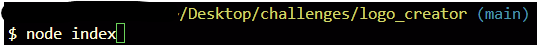
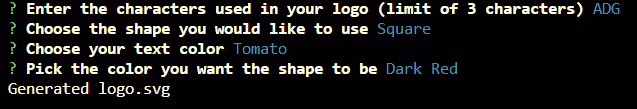

# SVG Logo Creator

This is an application that utilized Node.js to create an SVG file which displays a logo of the user's choice, as well as the color that the user chooses. You can also enter customized colors using either the color name, or hexadecimal properties to create the color. You can view the live demo [here](https://drive.google.com/file/d/1QkgSqbllUM8ao80NY5aZebj-ioJfg19P/view)

-   Creating a logo has never been made easier!
-   This program can be useful for a user or company to create a placeholder logo
-   Saves time for finding and/or creating a logo
-   I learned much more about how to use Node.js with this application
    -   Exporting and importing files was an interesting learning curve
    -   Creating classes and using them later to create the logo was a fantastic challenge!


## Installation

It is required to install Node.js to your machine to run this program. Here is how to do it:

#### For MacOS

```bash
brew install node
```

#### For Windows

```bash
scoop install nodejs
```

#### For Linux

```bash
apk add nodejs npm
```

Next, copy my application by going [here](https://github.com/dsatpm/logo_creator).

-   Click on the green 'Code' icon and copy the URL _or_ SSH Key. Information on how to do that can be found [here](https://docs.github.com/en/repositories/creating-and-managing-repositories/cloning-a-repository).
-   Once cloned, open 'readme_app' in your IDE of choice (I use [VSCode](https://code.visualstudio.com/)).


## Usage

You can use the application by following these steps:

#### Start

#### Run in your Terminal

_Important!_ **MAKE SURE YOU ARE IN THE CORRECT DIRECTORY**
<br>
<br>
<br>
<br>
Follow prompts
<br>
<br>

#### Finished product:


### Live Demo:
[Here](https://drive.google.com/file/d/1QkgSqbllUM8ao80NY5aZebj-ioJfg19P/view) is the demo.


## Credits

This application was made using [Node.js](https://nodejs.org/en), [Inquirer](https://www.npmjs.com/package/inquirer), [fs](https://nodejs.org/api/fs.html#fswritefilefile-data-options-callback), and [Jest](https://jestjs.io/docs/getting-started). The application was created by [me](https://github.com/dsatpm).
##### Other Sources:

- [Stack Overflow](https://stackoverflow.com/)
  - Promise functionality
  - SVG parameters
- [Node.js](https://nodejs.org/en)
  - Import/export assistance
- [Jest](https://jestjs.io/docs)
  - How to run tests properly
- [ChatGPT](https://chat.openai.com/)
  - Parsed through bugs in my application
  - Helped with structuring application properly


## License

[](https://opensource.org/licenses/MIT)


## Contributions

Please refer to the [Contributor Covenant](https://www.contributor-covenant.org/) for details on how to contribute.


